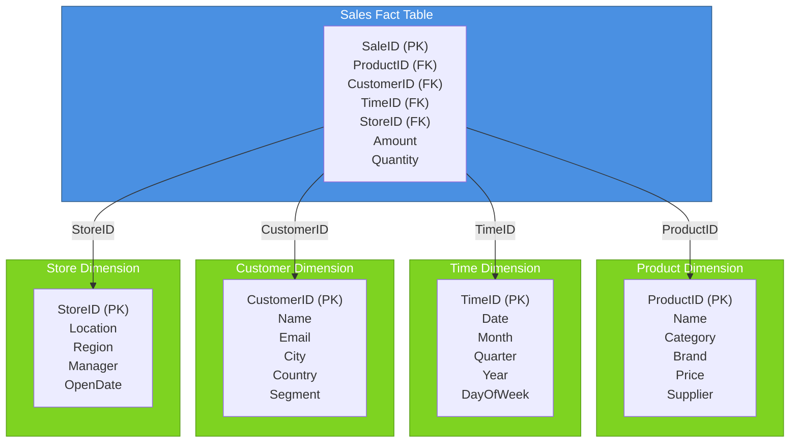
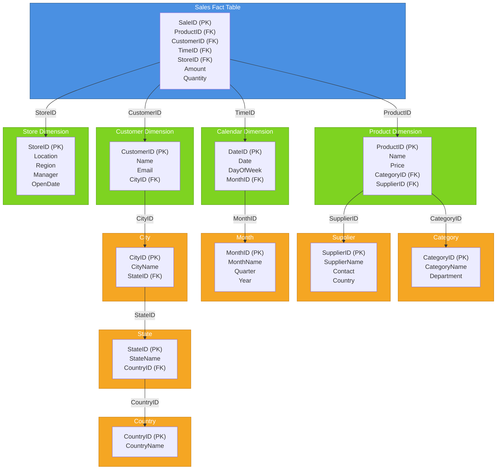

## Star Schema

**Structure:** One large central fact table surrounded by multiple dimension tables. The relationship pattern looks like a star when visualized.

**Key characteristics:**

- **Denormalized** — dimensions contain redundant data to avoid complex joins
- **Simpler queries** — fewer joins required (fact table joins directly to dimensions)
- **Faster query performance** — optimized for read-heavy analytical queries
- **More storage** — dimension tables contain repeated data

**Pros:**

- Fast queries (minimal joins)
- Intuitive for analysts
- Good for most OLAP scenarios

**Cons:**

- Data redundancy
- Updates to dimension data can be complex
- Higher storage requirements

## Snowflake Schema

**Structure:** A refinement of the star schema where dimension tables are themselves normalized into sub-dimensions, creating a snowflake pattern.

**Key characteristics:**

- **Normalized** — dimensions broken into hierarchies (e.g., Location → Region → Country)
- **More complex queries** — requires more joins between dimension tables
- **More storage efficient** — eliminates data redundancy
- **Slower queries** — additional joins add processing overhead

**Pros:**

- Reduced storage (normalized)
- Easier data maintenance
- Cleaner data model

**Cons:**

- Slower queries (more joins)
- More complex SQL
- Steeper learning curve for analysts

---

## Quick Comparison Table

|Aspect|Star|Snowflake|
|---|---|---|
|**Normalization**|Denormalized|Normalized|
|**Query Speed**|Faster|Slower|
|**Storage**|Higher|Lower|
|**Complexity**|Simple|Complex|
|**Joins**|Few|Many|
|**Best For**|Simple analytics|Complex hierarchies|

---

## When to Use Each

**Use Star Schema when:**

- Query performance is critical
- Users are non-technical (need simplicity)
- Dimension hierarchies are shallow
- Storage isn't a constraint

**Use Snowflake Schema when:**

- Data integrity is paramount
- Complex hierarchical dimensions exist
- Storage efficiency matters
- Updates to dimension data are frequent
- You have skilled analysts who understand normalization

---

## Real-World Example

**Retail Sales Analysis:**

**Star:** Single Product Dimension (Product ID, Name, Category, Brand, Price, Supplier) + Fact Table  
→ _One simple join, fast queries, but Category/Brand/Supplier data repeats_

**Snowflake:** Product ID → Product Table → Category Table; Category Table → Supplier Table  
→ _More joins, less redundancy, more flexible if supplier changes_

---

This should give your readers a solid foundation for understanding when and why to choose each approach!