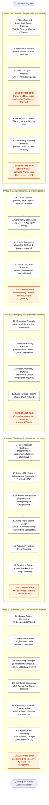

```mermaid
flowchart TD
    classDef step fill:#ffffff,stroke:#333333,stroke-width:1px,color:#000000;
    classDef book fill:#fff3e0,stroke:#e65100,stroke-width:2px,color:#bf360c,font-weight:bold;
    classDef phase fill:#e8eaf6,stroke:#3f51b5,stroke-width:2px,color:#1a237e,font-weight:bold;

    Start([🚀 Start Learning Path]) --> Phase1

    %% ==========================================
    %% PHASE 1: LOW-LEVEL & ENTERPRISE CODE DESIGN
    %% ==========================================
    subgraph Phase1 ["Phase 1: In-Memory & Single-Node Architecture"]
        direction TB
        S1["1. Object-Oriented Principles & Design Patterns<br/><i>(SOLID, Strategy, Factory, Observer)</i>"]:::step
        S1 --> S2["2. Persistence Patterns<br/><i>(Active Record vs. Data Mapper)</i>"]:::step
        S2 --> S3["3. State Management Patterns<br/><i>(Unit of Work, Identity Map)</i>"]:::step
        S3 --> B1["📖 CHECKPOINT BOOK:<br/>Patterns of Enterprise Application Architecture<br/>(Fowler)"]:::book
        B1 --> S4["4. Low-Level I/O Patterns<br/><i>(Blocking vs. Non-blocking I/O)</i>"]:::step
        S4 --> S5["5. Concurrency Handling Patterns<br/><i>(Thread Pools, Reactor, Proactor)</i>"]:::step
        S5 --> B2["📖 CHECKPOINT BOOK:<br/>Pattern-Oriented Software Architecture<br/>(Buschmann et al.)"]:::book
    end

    Phase1 --> Phase2

    %% ==========================================
    %% PHASE 2: DOMAIN-DRIVEN DESIGN
    %% ==========================================
    subgraph Phase2 ["Phase 2: Complex Business Domain Modeling"]
        direction TB
        S6["6. Domain Isolation<br/><i>(Entities, Value Objects, Domain Services)</i>"]:::step
        S6 --> S7["7. Consistency Boundaries<br/><i>(Aggregates & Aggregate Roots)</i>"]:::step
        S7 --> S8["8. System Boundaries<br/><i>(Bounded Contexts & Context Mapping)</i>"]:::step
        S8 --> S9["9. Legacy Integration Patterns<br/><i>(Anti-Corruption Layer, Shared Kernel)</i>"]:::step
        S9 --> B3["📖 CHECKPOINT BOOK:<br/>Implementing Domain-Driven Design<br/>(Vernon)"]:::book
    end

    Phase2 --> Phase3

    %% ==========================================
    %% PHASE 3: ASYNCHRONOUS INTEGRATION
    %% ==========================================
    subgraph Phase3 ["Phase 3: Messaging & Event Driven Patterns"]
        direction TB
        S10["10. Messaging Channels<br/><i>(Point-to-Point, Publish-Subscribe)</i>"]:::step
        S10 --> S11["11. Message Routing Patterns<br/><i>(Content-Based Router, Splitter, Aggregator)</i>"]:::step
        S11 --> S12["12. Data Consistency Patterns<br/><i>(Transactional Outbox, Idempotent Consumer)</i>"]:::step
        S12 --> S13["13. Large Payload Patterns<br/><i>(Claim Check Pattern)</i>"]:::step
        S13 --> B4["📖 CHECKPOINT BOOK:<br/>Enterprise Integration Patterns<br/>(Hohpe & Woolf)"]:::book
    end

    Phase3 --> Phase4

    %% ==========================================
    %% PHASE 4: MICROSERVICES ARCHITECTURE
    %% ==========================================
    subgraph Phase4 ["Phase 4: Distributed Application Architecture"]
        direction TB
        S14["14. Decomposition Strategies<br/><i>(Decompose by Subdomain / Business Capability)</i>"]:::step
        S14 --> S15["15. External API Patterns<br/><i>(API Gateway, Backend-for-Frontend - BFF)</i>"]:::step
        S15 --> S16["16. Distributed Transactions<br/><i>(Saga Pattern: Choreography vs. Orchestration)</i>"]:::step
        S16 --> S17["17. Read-Heavy System Design<br/><i>(CQRS - Command Query Responsibility Segregation)</i>"]:::step
        S17 --> S18["18. Auditability Patterns<br/><i>(Event Sourcing)</i>"]:::step
        S18 --> S19["19. Resilience Patterns<br/><i>(Circuit Breaker, Rate Limiting, Bulkhead)</i>"]:::step
        S19 --> B5["📖 CHECKPOINT BOOK:<br/>Microservices Patterns<br/>(Richardson)"]:::book
    end

    Phase4 --> Phase5

    %% ==========================================
    %% PHASE 5: ADVANCED DISTRIBUTED SYSTEMS
    %% ==========================================
    subgraph Phase5 ["Phase 5: Distributed Data & Infrastructure Internals"]
        direction TB
        S20["20. Storage Engine Mechanics<br/><i>(B-Trees vs. LSM-Trees)</i>"]:::step
        S20 --> S21["21. Replication Patterns<br/><i>(Single-Leader, Multi-Leader, Leaderless)</i>"]:::step
        S21 --> S22["22. Partitioning Strategies<br/><i>(Consistent Hashing, Key-Range, Secondary Indexes)</i>"]:::step
        S22 --> S23["23. Distributed Consensus<br/><i>(Raft, Paxos, Two-Phase Commit)</i>"]:::step
        S23 --> S24["24. Consistency & Isolation<br/><i>(Linearizability, Serializability vs. Eventual Consistency)</i>"]:::step
        S24 --> S25["25. Stream & Batch Processing<br/><i>(Event Streams, Change Data Capture - CDC)</i>"]:::step
        S25 --> B6["📖 CHECKPOINT BOOK:<br/>Designing Data-Intensive Applications<br/>(Kleppmann)"]:::book
    end

    Phase5 --> Finish([🏆 Principal Systems Architect Mastery])
```

